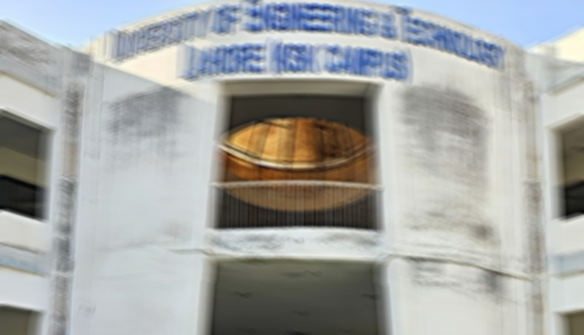
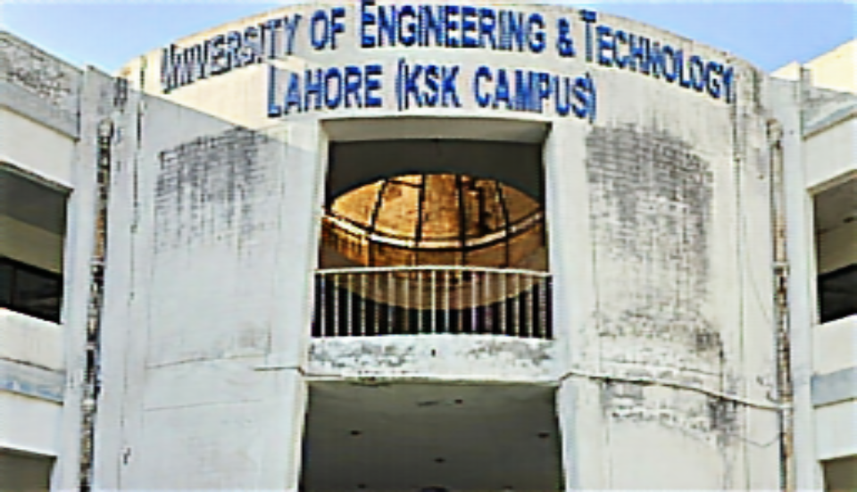

# Hybrid CNN-ViT Model for Motion-Blurred Scene-Text Image Deblurring

## Overview
This repository provides a **summary** of the Final Year Project (FYP) research paper:

*"Hybrid CNN-ViT Model for Motion-Blurred Scene-Text Image Deblurring"*

The project focuses on restoring motion-blurred scene-text images using a hybrid architecture combining **Convolutional Neural Networks (CNNs)** and **Vision Transformers (ViT)**. The model is trained on a TextOCR-based dataset augmented with **realistic motion blur kernels**, improving the readability of degraded scene-text images.

---

## Features
- **Hybrid Architecture:** CNN encoder for local features and ViT module for global contextual understanding.  
- **Realistic Motion Blur:** Utilizes real motion blur kernels from the dataset by Shen et al.  
- **Scene-Text Restoration:** Optimized to preserve clarity and readability of text.  
- **End-to-End Workflow:** Includes preprocessing, augmentation, and evaluation pipeline.

---

## Dataset
- **Base Dataset:** TextOCR Dataset ([link](https://textvqa.org/textocr/))  
- **Motion Blur Kernels:** From “Deep Semantic Face Deblurring” by Ziyi Shen et al. ([link](https://sites.google.com/site/ziyishenmi/cvpr18_face-deblur))  
- **Preprocessing:** Images resized to 256×256, normalized, and augmented with motion blur.

---

## Results
The hybrid CNN-ViT model significantly enhances deblurring performance on motion-blurred scene-text images. Quantitative metrics (PSNR, SSIM) and qualitative results demonstrate clear text restoration.

### Example Output

**Before:**  


**After:**  


> *Note: Images are for illustration only. The full model code and pretrained weights will be made public following formal journal publication.*

---

## Citation
If you use this work in your research, please cite:

```bibtex
@misc{rashid2025hybridcnnvitframeworkmotionblurred,
      title={Hybrid CNN-ViT Framework for Motion-Blurred Scene Text Restoration}, 
      author={Umar Rashid and Muhammad Arslan Arshad and Ghulam Ahmad and Muhammad Zeeshan Anjum and Rizwan Khan and Muhammad Akmal},
      year={2025},
      eprint={2511.06087},
      archivePrefix={arXiv},
      primaryClass={cs.CV},
      url={https://arxiv.org/abs/2511.06087}, 
}
